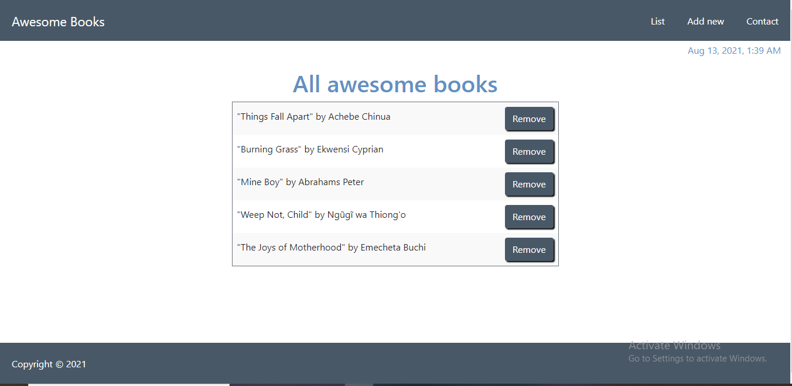

# Awesome_Books
This is a simple website that displays a list of books and allows you to add and remove books from that list.


## Built With

- HTML5
- Bootstrap
- Javascript

## Clone This Project

```
- $ Run the command `$ git clone https://github.com/dami1080/AwesomeBook.git`
- $ cd AwesomeBook
```

## Live Demo

<a href="https://raw.githack.com/dami1080/AwesomeBook/complete-website/index.html">Live version</a>

## ✒️ Author <a name = "author"></a>

👤 **Nkiruka Awotoruvie**

- Github: [@enkog](https://github.com/enkog)
- Linkedin: [@enkog](https://www.linkedin.com/in/enkog/)
- Twitter: [@enkodes](https://twitter.com/enkodes)

👤 **Damilare Akintoye**

- Github: [@dami1080](https://github.com/dami1080)

## Acknowledgements

- [Microverse](https://www.microverse.org/)